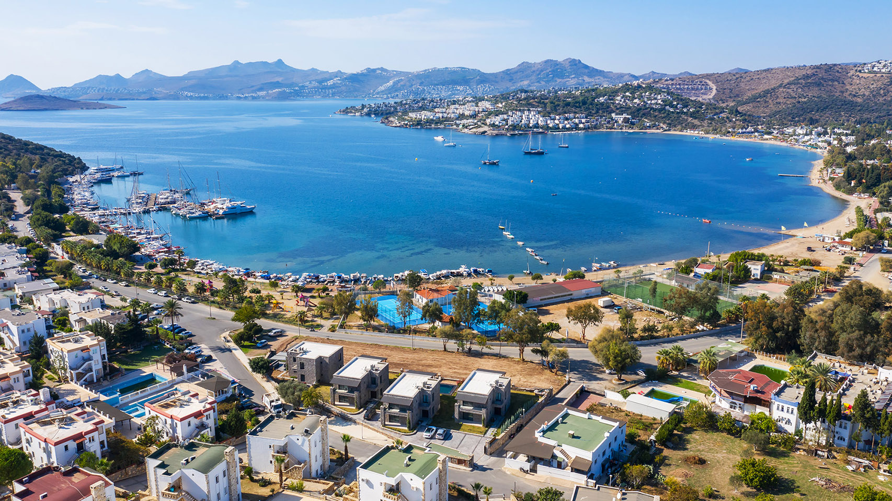

# 🧡 BİTEZ

This stunning beach boasts pristine sandy shores, ancient Greek ruins with stunning mosaics, and a variety of water sports to suit all tastes. Relax on comfortable sun loungers or hammocks under the shade of citrus groves while sipping on refreshing cocktails or indulging in mouthwatering Turkish cuisine at local restaurants and bars. The crystal-clear waters offer endless opportunities for swimming, paddleboarding, jet skiing, and parasailing, making it a haven for both families and thrill-seekers alike.

<figure><figcaption></figcaption></figure>

***

### Bitez Restaurants

* [Lemon Tree Bitez](https://www.facebook.com/profile.php?id=100063562420039)
* [Kutu Bahce](https://www.kuytubahce.com/)

<figure><figcaption>
Stunning Turkish Village breakfast - not to be missed!
</figcaption></figure>
