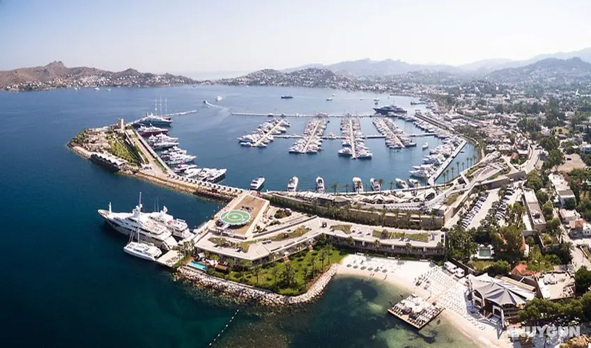

# 😍 YALIKAVAK

## Yalikavak Marina

| 
 Ali ÇINAR - 0 533 417 66 08
 |
| -------------------------------------- |
|                                        |

Yalıkavak Marina, voted the 2022 World’s Best Superyacht Marina, 2020-2021 International Marina of the Year & 2018-2019 World’s Best Superyacht Marina and a holder of the British Yacht Harbor Association’s (TYHA) 5 Gold Anchors rating, is Türkiye’s first high-capacity superyacht marina. As of 2021, Yalıkavak Marina became the first and only Turkish marina awarded with 5 Gold Anchor Platinum rating by TYHA and ranked among the top 10 marinas in the world. Yalıkavak Marina can accommodate 620 berths and provides high-class lifestyle choices and unmatched services including comfortable facilities and professional technical services for yachts of up to 140m LOA. More than 100 superyachts visit Yalıkavak Marina every year, among them are such as the iconic guests as Eclipse, Madame Gu, Voice, Arrow, Vertige, Chakra, Galactica Super Nova, Saluzi, Okto, O’Matilde and others.

<figure><figcaption></figcaption></figure>

Where to stay?

* ## [Yuksel Boutique Hotel](https://www.yukselbutikhotel.com/)
* ## [Onur Hotel](https://www.onurotel.net/)

### Yalıkavak Restaurant

* [Bagatelle Bodrum](https://bagatelle.com/venues/bodrum/)
*
